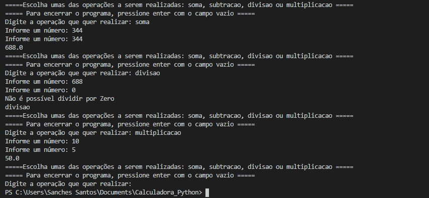

# Calculadora_Simples-Python
 
Uma simples calculadora que criei com Python, conseguimos fazer as operações:
 
1. Soma
2. Subtração
3. Divisão
4. Multiplicação
 
Para deixar o código mais limpo possível optei por criar uma função, com todas as condições. E em seguida coletar os dados dos usuários e chamar a função em seguida.

Foi criado um tratamento de erro com o Try e Except para apresentar ao usuário um erro quando tentar dividir um número por 0

Abaixo segue um print do código em funcionamento:

